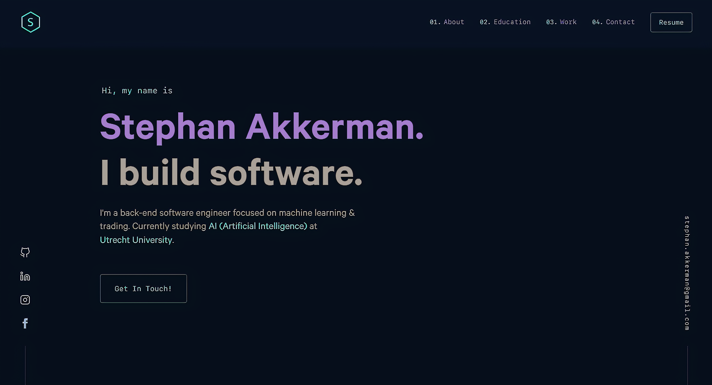

<div align="center">
  
</div>
<h1 align="center">
  StephanAkkerman.Github.io
</h1>
<p align="center">
  My personal website, <a href="https://stephanakkerman.github.io" target="_blank">StephanAkkerman.github.io</a>
  <br>
  Built with <a href="https://www.gatsbyjs.org/" target="_blank">Gatsby</a> and hosted with <a href="https://pages.github.com/" target="_blank">GitHub Pages</a>, credits go to <a href="https://brittanychiang.com" target="_blank">brittanychiang.com</a> for the awesome website.
  Shout out to <a href="https://github.com/hivestrung" target="_blank">Shiv Godhia</a> for his comprehensive tutorial of how to deploy this site using GitHub pages.
</p>



## 🚨 Forking this repo (please read!)

I used Britanny Chiang's website design for this website. 
She has made this publicly availble for everyone to use, but please give credit if you do.
Check out her [GitHub page](https://github.com/bchiang7/v4) for more info.

## To Do
- Make new resume
- Fix Facebook SVG
- Deploy .com site
- Light mode toggle
- Cleaner skills overview

## 🛠 Installation & Set Up

1. Install the Gatsby CLI

   ```sh
   npm install -g gatsby-cli
   ```

2. Install and use the correct version of Node using [NVM](https://github.com/nvm-sh/nvm)

   ```sh
   nvm install
   ```

3. Install dependencies

   ```sh
   yarn
   ```

4. Start the development server

   ```sh
   npm start
   ```

## 🚀 Building and Running for Production

1. Generate a full static production build

   ```sh
   npm run build
   ```

1. Preview the site as it will appear once deployed

   ```sh
   npm run serve
   ```

## 🎨 Color Reference

The color names don't represent the color, since it was easier to change the ./src/styles/variables.js than to rename all the variables.

| Color          | Hex                                                                |
| -------------- | ------------------------------------------------------------------ |
| Navy           |  `#081424` |
| Light Navy     |  `#2a2b4b` |
| Lightest Navy  |  `#303c55` |
| Slate          |  `#8892b0` |
| Light Slate    |  `#a8b2d1` |
| Lightest Slate |  `#a37ccb` |
| White          |  `#e6f1ff` |
| Green          |  `#75ccbf` |
